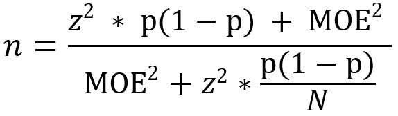

```{r setup, include=FALSE}
knitr::opts_chunk$set(echo = FALSE)
```


##  My App: Sample Size Calculator
- This app is designed to calculate sample sizes
- This formula assumes a known large population size (i.e 30 or greater) without replacement
- The app asks for user input of Population Size, Margin of Error, Confidence Level, and Population proportion and displays the calculated sample size 


## Methodology
- Formula:

-  where
    - n = sample size
    - N = population size
    - MOE = Margin of error
    - z = Z-score (obtained from confidence level)
    - p = population proportion

## Methodology (Cont.)

- The distribution used to obtain the z value is the normal distribution
- Formula taken from https://stattrek.com/sample-size/simple-random-sample


## 

<font size="1000">
<div class="blue2">
 Thanks for Watching!
</div>
</font>


 
